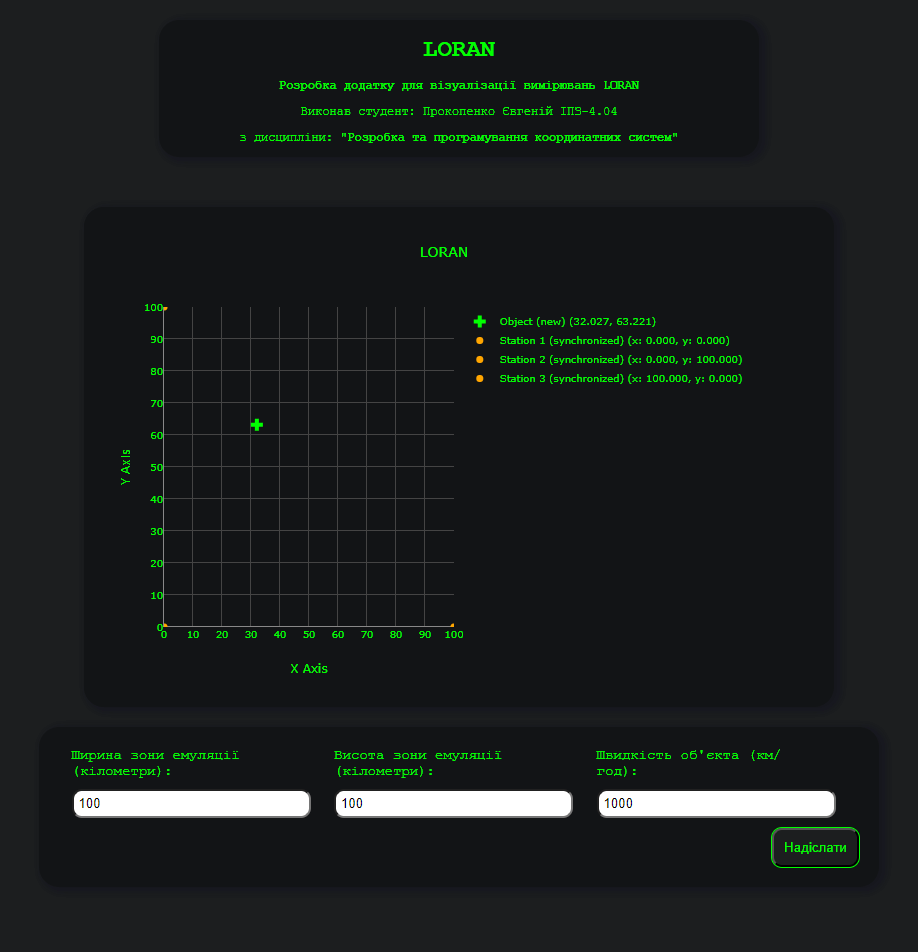
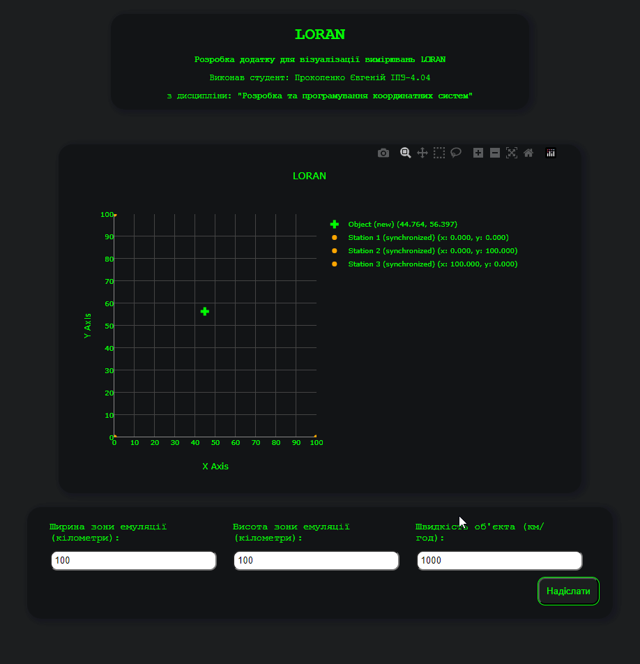

## Титул

<br>

<p align="center" style="font-size: 30px;">
    <b>Розробка додатку для візуалізації вимірювань LORAN</b>
</p>
<p align="center" style="font-size: 24px;">
    Виконав студент: Прокопенко Євгеній ІПЗ-4.04
</p>
<p align="center" style="font-size: 24px;">
    з дисципліни: <b>"Розробка та програмування координатних систем"</b>
</p>

<br>

## Мета

Розробити додаток, який зчитує дані з емульованої вимірювальної частини `LORAN`, наданої у вигляді `Docker image`, та відображає положення об'єкта і базових станцій на графіку в декартових координатах.

## Завдання

Згідно до поставленого завдання необхідно було створити додаток, що в реальному часі відображає дані положення об'єкта на графіку за допомоги `LORAN` та дозволяє змінювати параметри емулятору станцій.

1. **Розробити додаток для відображення положення об'єкта і базових станцій:**
    - Розробити веб-додаток, який підключається до `WebSocket` сервера та зчитує дані про часи отримання сигналів базовими станціями;
    - Використовувати різниці часу прибуття сигналів для розрахунку місцезнаходження об'єкта;
    - Відобразити отримані дані на графіку в декартових координатах.
2. **Обробка та візуалізація даних:**
    - Обробити дані, отримані через WebSocket, і відобразити положення об'єкта і базових станцій на графіку;
    - Здійснити розрахунок координат об'єкта за допомогою методу найменших квадратів та градієнтного спуску.
3. **Налаштування графіка:**
    - Відобразити координати базових станцій та об'єкта у декартових координатах;
    - Використати різні кольори або стилі точок для відображення базових станцій та об'єкта.

## Конфігурація середи

Емулятор `LORAN` надається у вигляді Docker зображення під назвою `loran-emulation-service`.

Команда завантаження Docker зображення з Docker Hub:

> docker pull iperekrestov/university:loran-emulation-service

Запуск контейнера з ім'ям `loran-emulator` з відкриттям порту `4002` для з'єднання з емульованою вимірювальною частиною LORAN:

```bash
 docker run --name loran-emulator -p 4002:4000 iperekrestov/university:loran-emulation-service
```
## API вимірювальної частини LORAN

Сервіс LORAN підтримує API для зміни наступних параметрів:

- `emulationZoneSize` : розмір зони емуляції;
- `objectSpeed`: швидкість руху об'єкта.

За замовчуванням застосовані наступні параметри:

- `emulationZoneSize` : 100x100 км;
- `objectSpeed`: 100 км/год.

Дані, які надсилаються через WebSocket, містять інформацію про базові станції та об'єкт. Повідомлення представляються у форматі JSON і мають наступну структуру:

```bash
{
  "id": "uuid", // Унікальний ідентифікатор повідомлення (UUID)
  "sourceId": "source_x",  // Ідентифікатор базової станції, яка надіслала сигнал
  "receivedAt": 1692170400100 // Час отримання сигналу базовою станцією (мілісекунди з початку епохи Unix)
}

```

## Розробка проєкта

#### 1. Технології

Для створення додатку візуалізації `LORAN` було обрано `JavaScript`, `HTML` і `CSS` через їхню потужність у створенні інтерактивних та стильних інтерфейсів. `JavaScript` дозволяє динамічно оновлювати дані та управляти взаємодією користувача. `HTML` надає структуру, а `CSS` — стилізацію.

Для графіків було вирішено використовувати `Plotly`, що забезпечує розширені можливості для створення графічних візуалізацій. 

Серверна частина налаштована з використанням `Express` і `middleware` для проксі, що дозволяє зручно обробляти запити, маршрутизацію та є необхідною для вирішення обмежень браузерної системи. `Node.js` забезпечує середовище для виконання серверного коду.
Для управління залежностями було застосовано `npm`.

Для обчислення координат за допомогою методу найменших квадратів та градієнтного спуску на `Python` сервері, створеному за допомоги бібліотеки `flask` використовуються спеціалізовані алгоритми обчислення.

#### 2. CORS політика

CORS (Cross-Origin Resource Sharing) — це механізм, який дозволяє веб-додаткам, що виконуються в одному домені, взаємодіяти з ресурсами, що знаходяться на іншому домені.

Для можливості відправлення запиту (наприклад, POST, PUT) з браузеру від імені іншого домену до домену конфігурації Docker зображення LORAN (`http://localhost:4002/config`) необхіно, щоб веб-сервер дозволяв подібні запити з інших доменів.

Шляхом випробувань було з'ясовано, що веб-сервер не відповідає на `OPTIONS` запити браузера своїми спеціальними заголовками.

Для вирішення цієї проблеми було зроблено налаштування проксі-сервера з використанням пакетів `express` і `http-proxy-middleware`, для вирішення проблеми з CORS політикою браузера. Проксі-сервер на порту `3000` перенаправляє запити до конфігураційного сервера Docker на `http://localhost:4002`. Це дозволяє обробляти запити, такі як `POST` і `GET`, які можуть бути заблоковані через обмеження `CORS`.

Конфігурація включає:

- Проксі для API: 

    - Перенаправлення запитів з `/loran_service` до Docker зображення для конфігурації `LORAN`;
    - Перенаправлення запитів з `/loran_calculator` до `python` сервера обчислення координат.   
- Обробка статичних файлів: Сервер обробляє статичні ресурси з директорії `public`;
- Встановлення гоовної сторінки: Відповідає на запити до кореневого маршруту, надаючи основний HTML файл.

Налаштування веб-серверу відбувається у головному js файлі веб-сервера — `proxy.js`. 

Запуск проєкта ( `python` та `js` серверів ) виконується командою:

> npm run start

#### 3. Приймання повідомлень LORAN

Для приймання повідомлення від `LORAN` емулятору було створено клас `LORANService`, файл `public/src/LORANService.js`.

Клас `LORANService` забезпечує взаємодію з LORAN-системою, надаючи наступні можливості:

- Отримання конфігурації `LORAN`: Метод `fetchConfiguration` здійснює запит на сервер для отримання актуальної конфігурації системи `LORAN`;

- Оновлення конфігурації `LORAN`: Метод `updateConfiguration` дозволяє змінювати конфігурацію, відправляючи нові параметри на сервер;

- Підключення до `WebSocket`: Метод `connectWebSocket` ініціює підключення до `WebSocket`, обробляє вхідні повідомлення і генерує кастомні події для обробки даних.

Конструктор класу приймає об'єкт props, що містить такі параметри:

- `configUrl`: URL-адреса для отримання конфігурації `LORAN`;
- `socketUrl`: URL-адреса для підключення до `WebSocket`;
- `eventName`: Назва події, яка генерується при отриманні даних з `LORAN`.

**Отримання конфігурації**

Метод `fetchConfiguration` виконує HTTP-запит до сервера для отримання поточної конфігурації:

```javascript

const response = await fetch(this.props.configUrl, {
  method: "GET",
  headers: {
    "Content-Type": "application/json",
  },
});
```

**Оновлення конфігурації**

Метод `updateConfiguration` відправляє нову конфігурацію на сервер:

```javascript
const response = await fetch(this.props.configUrl, {
  method: "POST",
  headers: {
    "Content-Type": "application/json",
  },
  body: JSON.stringify(newConfig),
});
```

**Підключення до WebSocket**

Метод `connectWebSocket` ініціює підключення до `WebSocket`, обробляє вхідні повідомлення у форматі JSON, генерує події та обробляє помилки:

```javascript
this.websocket = new WebSocket(this.props.socketUrl);

this.websocket.onmessage = (event) => {
  try {
    const data = JSON.parse(event.data);
    const customEvent = new CustomEvent(this.props.eventName, {
      detail: data,
    });
    window.dispatchEvent(customEvent);
  } catch (error) {
    console.error("Failed to parse data:", error);
  }
};
```

#### 4. Зберігання та обробка данних від базових станцій

Для зберігання та обробка данних від базових станцій було створено клас `LORANStorage`, файл `public/src/LORANStorage.js`.

**Основні можливості класу:**

- Зберігання даних базових станцій: Клас використовує `Map` для зберігання координат базових станцій, що дозволяє легко отримувати та оновлювати їх інформацію;

- Обробка повідомлень: Метод `addStationInfo` дозволяє додавати нові повідомлення від базових станцій, які ще не були оброблені. Метод `processMessages` відповідає за обробку цих повідомлень, зокрема за визначення найстаршого повідомлення та обчислення координат за допомогою калькулятора `LORAN`;

- Оновлення конфігурації базових станцій: Метод `updateConfiguration` дозволяє оновлювати налаштування базових станцій, зокрема їх розташування та розмір зони емуляції;

- Отримання поточних даних: Метод `getCurrentData` повертає статус базових станцій та обчислену точку, що дозволяє користувачам отримувати актуальну інформацію про стан системи.

#### 5. Обчислення координат об'єкту за допомоги різниці часу прибуття сигналів

Для обчислення координат об'єкту за допомоги різниці часу прибуття сигналів було створено клас `LORANCalculator`, файл `public/src/LORANCalculator.js`.

**Основні можливості класу:**

- Ініціалізація: Конструктор класу приймає `URL API`, який використовується для надсилання запитів на обчислення координат;

- Обчислення даних `LORAN`: Метод `calculateLoranData` відповідає за надсилання даних про точки (координати та часи їх отримання) на сервер для обробки. Він використовує `HTTP POST-запит`, передаючи дані у форматі `JSON`;

- Обробка відповіді: Якщо запит до сервера був успішним, метод повертає результат у форматі `JSON`, який містить обчислені координати об'єкту. У разі виникнення помилки під час запиту або обробки даних, метод виведе повідомлення про помилку в консоль і викине виключення.

#### 6. Будування графіка LORAN

Для керуванням створення та оновлення графіка радара, було створено клас `LORANGraph`, файл `public/src/LORANGraph.js`.

**Основні можливості класу:**

- Ініціалізація графіка: Конструктор класу приймає ідентифікатор графіка (`plotId`) і налаштовує початкові параметри для відображення даних, включаючи осі координат, заголовок графіка та кольори;

- Оновлення конфігурації: Метод `updateConfiguration` дозволяє змінювати параметри графіка на основі нових даних, зокрема змінюючи діапазон і крок для осей `X` та `Y` відповідно до розміру зони емуляції;

- Ініціалізація та рендеринг графіка: Метод `init` виконує ініціалізацію графіка з використанням `LORANStorage`, починає періодичне оновлення графіка, що виконується кожні `20 мс`. Він викликає метод render для оновлення даних графіка та їх візуалізації;

- Рендеринг даних графіка: Метод `render` відповідає за візуалізацію позицій об'єкта та базових станцій. Він додає маркери для об'єкта та станцій на графік, використовуючи різні кольори та символи в залежності від статусу отриманих даних. Активні базові станції змінюють колір з сірого на помаранчевий при отриманні з них повідомлення.

#### 6. Оновлення конфігурації

Для керуванням форми оновлення конфігурації радара, було створено клас `GPSConfig`, файл `public/src/GPSConfig.js`.

**Основні властивості:**
- `formElement`: HTML-елемент форми, з яким працює клас;
- `validator`: Об'єкт, що містить методи для валідації полів форми;
- `callback`: Функція, яка викликається після успішного створення конфігураційного об'єкта;
- `configs`: Map, що використовується для зберігання конфігураційних значень, розподілених за ключами.

**Основні методи:**
- Конструктор: Приймає `formElement`, `validator` і `callback` та ініціалізує їх.
Додає слухача події `submit`, який викликає метод `handleSubmit`;

- `handleSubmit(event)`: Обробляє подачу форми, запобігаючи її стандартній поведінці.
Створює об'єкт конфігурації за допомогою методу `createConfigObject` та викликає `callback`, якщо дані валідні;

- `createConfigObject()`: Створює об'єкт конфігурації, збираючи значення з полів форми.
Валідує значення полів за допомогою `validateField` та структурує їх у вкладений об'єкт;

- `addNestedConfig(config, name, value)`: Додає вкладене значення до конфігурації на основі імені поля, яке містить крапки для вказівки вкладеності;

- `validateField(fieldName, value, errorContainer)`: Валідує окремі поля форми, викликаючи відповідний метод з об'єкта `validator`. Якщо валідація не проходить, відображає повідомлення про помилку;

- `getConfigObject()`: Повертає фінальний об'єкт конфігурації, збираючи дані з `configs`;

- `setConfig(config)`: Встановлює значення конфігурації в поля форми, заповнюючи їх відповідно до даних, переданих у метод;

- `setNestedConfigValue(config, keys, input)`: Встановлює значення для вкладених полів на основі ключів та переданого елемента;

- `clearErrors()`: Очищає повідомлення про помилки в формі, видаляючи текст з контейнерів для помилок.

#### 7. Головний скрипт index.html

Головний скрипт відповідає за ініціалізацію та управління `LORAN`-системою. При готовності документа запускається асинхронна функція `main`, яка виконує такі основні завдання:

- Імпорт необхідних класів: Скрипт імпортує кілька класів, включаючи `LORANService`, `LORANGraph`, `Config`, `ConfigValidator`, `LORANStorage` та `LORANCalculator`, які забезпечують різні функціональні можливості системи;

- Налаштування параметрів `LORANService`: Оголошуються параметри для `LORAN-сервісу`, такі як `URL` для отримання конфігурації та `URL` для підключення до WebSocket;

- Ініціалізація екземплярів: Створюються екземпляри класів для `LORAN-сервісу`, графіка, зберігання даних та валідації конфігурацій;

- Завантаження конфігурації: Асинхронна функція `main` завантажує конфігурацію `LORAN-сервісу` через `HTTP` запит;

- Підключення до `WebSocket`: Після отримання конфігурації встановлюється з'єднання з `WebSocket` для отримання даних `LORAN` у реальному часі;

- Валідація конфігурації: Ініціалізується конфігурація `LORAN` з використанням об'єкта `Config`, який також виконує валідацію параметрів;

- Обробка подій: Додається слухач подій для обробки отриманих даних `LORAN`, які додаються до `LORANStorage`;

- Оновлення графіка: Графік `LORAN` та зберігання оновлюються новими конфігураціями, а також ініціалізується графік збереженими даними станцій.

#### 8. Результат

Виконаємо запуск проєкта: Docker зображення та серверів.

**Результат:**

<br>
<div align="center">
    
</div>
<br>

Спробуємо змінити параметри `LORAN`.

**Результат:**

<br>
<div align="center">
    
</div>
<br>

**LORAN працює, запити зміни конфігурації виконуються!**

## Висновок

`Loran` (Long Range Navigation) — це радіонавігаційна система, яка використовується для визначення позиції та часу за допомогою радіосигналів. `Loran` працює на основі передачі низькочастотних імпульсних сигналів від наземних станцій, які отримуються приймачем. Система забезпечує високу точність позиціонування, особливо в умовах, де інші системи, такі як GPS, можуть бути недоступні або ненадійні.

Корисність `Loran`:

**Висока точність:** `Loran` може забезпечити точність позиціонування до 10-30 метрів, що робить його корисним для морської навігації, аеронавтики та інших застосувань.

**Стійкість до перешкод:** Оскільки `Loran` працює на низьких частотах, його сигнали менш чутливі до перешкод, викликаних атмосферними умовами, ніж сигнали високочастотних систем.

**Доступність:** `Loran` не залежить від супутників, що робить його корисним у віддалених або важкодоступних місцях, де немає сигналу GPS.

**Допоміжна система:** `Loran` може використовуватися як резервна навігаційна система в разі виходу з ладу GPS, забезпечуючи безпеку морських і повітряних перевезень.

У ході виконання цієї роботи я підтвердив теоретичний матеріал з теми розробки додатку для візуалізації вимірювань `LORAN`, а саме: розробив додаток, який зчитує дані з емульованої вимірювальної частини `LORAN`, наданої у вигляді Docker image, та відображає положення об'єкта і базових станцій на графіку в декартових координатах.

Отриманні знання та навички являють собою основу при розробці програмних систем та при вивчені дисципліни `Розробка та програмування координатних систем` в цілому.